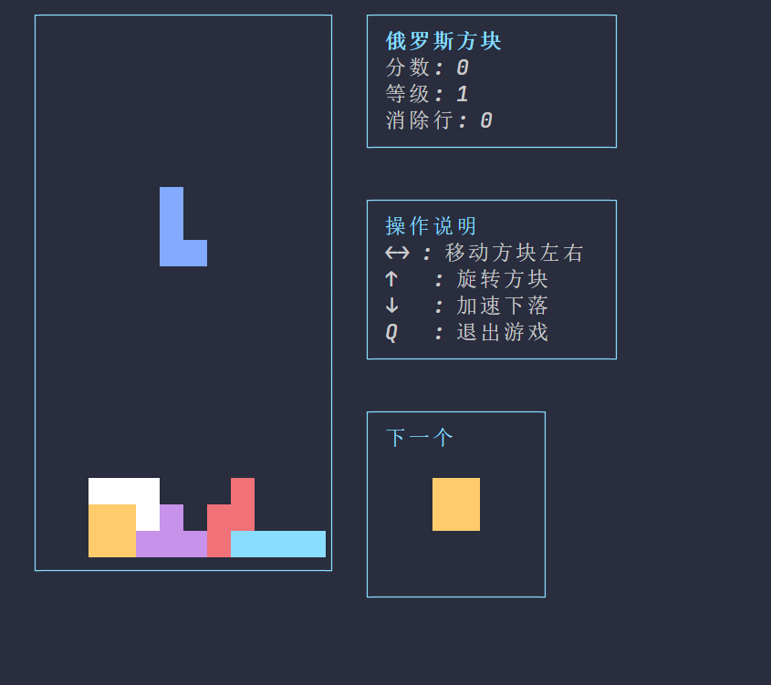

# Command Line Tetris Game

This is a command-line interface implementation of the classic Tetris game, written in C++. The game features colored blocks, score tracking, level system, and more.

## Features

- Classic Tetris gameplay mechanics
- Colored terminal interface
- 7 different tetrimino shapes
- Real-time next piece preview
- Display of current score, level, and cleared lines
- Game speed increases with level progression

## Start Screen


## Game Screen


## System Requirements

- Linux operating system
- C++17 or higher
- CMake 3.10 or higher
- Terminal with ANSI escape sequence support

## Building and Running

1. Create a build directory:
```bash
mkdir -p build
cd build
```

2. Generate build files with CMake:
```bash
cmake ..
```

3. Compile the project:
```bash
make
```

4. Run the game:
```bash
./tetris
```

## Game Controls

- ←: Move piece left
- →: Move piece right
- ↑: Rotate piece
- ↓: Accelerate piece descent
- Q: Quit game

## Game Rules

- Pieces automatically fall, and players can control their movement and rotation
- When a line is completely filled, it will be cleared and points are awarded
- More points are awarded for clearing multiple lines at once
- Every 10 lines cleared increases the level
- Game difficulty increases with each level (faster falling speed)
- Game ends when new pieces can't be placed

## Project Structure

```
.
├── CMakeLists.txt          # CMake build configuration
├── include/                # Header files directory
│   ├── game_logic.h       # Game logic
│   ├── game_state.h       # Game state
│   ├── renderer.h         # Renderer
│   ├── terminal.h         # Terminal control
│   └── tetris.h           # Main game class
└── src/                    # Source files directory
    ├── game_logic.cpp     # Game logic implementation
    ├── game_state.cpp     # Game state implementation
    ├── renderer.cpp       # Renderer implementation
    ├── terminal.cpp       # Terminal control implementation
    └── tetris.cpp         # Main game implementation
```

## Technical Details

This project utilizes:
- C++ Standard Library
- ANSI Terminal Control
- CMake Build System
- Object-Oriented Programming Design

## Contributing

Contributions and suggestions are welcome. If you'd like to contribute:

1. Fork the repository
2. Create your feature branch (`git checkout -b feature/AmazingFeature`)
3. Commit your changes (`git commit -m 'Add some AmazingFeature'`)
4. Push to the branch (`git push origin feature/AmazingFeature`)
5. Open a Pull Request